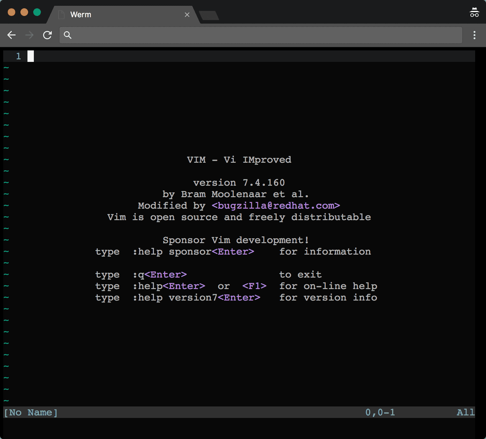

<h1 align="center">Werm</h1>

<h5 align="center">A minimal Terminal environment on Web</h5>

<div align="center"></div>

## Requirement

- Docker v17.06.0-ce~
- Kubernetes v1.7~
- GNU Make v3.82~

## Run

Set environment variables:

- `WERM_USER_NAME`
  - User name for basic authentication along with `WERM_USER_PASS`
  - Specifying no user name means no basic authentication
- `WERM_USER_PASS`
  - User password for basic authentication along with `WERM_USER_NAME`
  - Specifying no user password means no basic authentication
- `WERM_PROJECT_ID`
  - Your GCP project ID if you deploy it to Google Cloud Platform

Start Docker if you don't have Docker started

```sh
$ make start-docker
```

Then

```sh
$ make docker-build 
$ make docker-push
$ make create-deploy
$ make create-svc
```

### Test

```sh
$ yarn test
```

